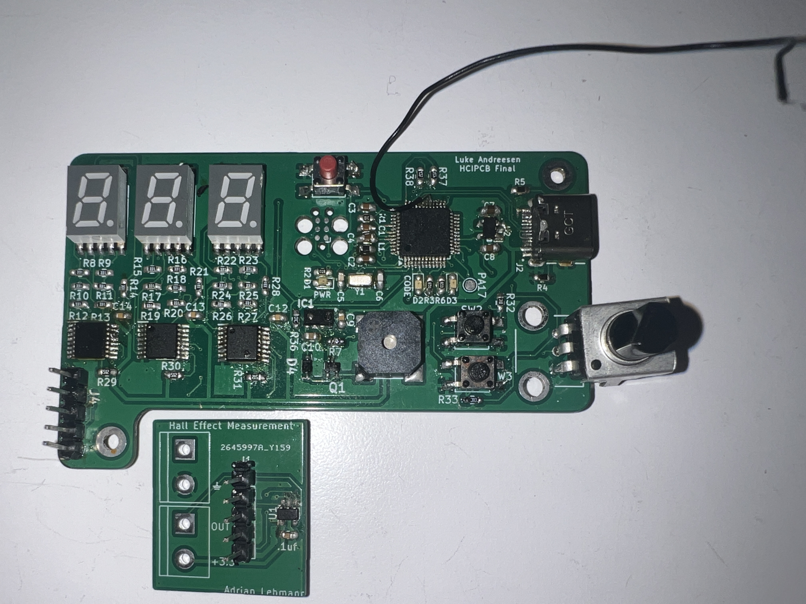

This project is a study timer that is meant to enforce productivity; an onboard
IR sensor, as well as a daughter-board hall-effect sensor module detect
a user's presence and ensure their phone is sitting on the desk and not in 
their hands. 3 daisy-chaineed shift registers control the 7-segment displays, 
and a magnetic buzzer and onboard LED's provide feedback and alerts. The 
devce connects to the user's computer via USB for power and serial connectivity
with the UI which can be interacted with using the board's buttons and 
potentiometer dial. This was my first independent PCB board, and I really
enjoyed the process of designing, soldering, and programming it!

A Bill of Materials is available as CSV in this repo, along with KiCad schematics.
